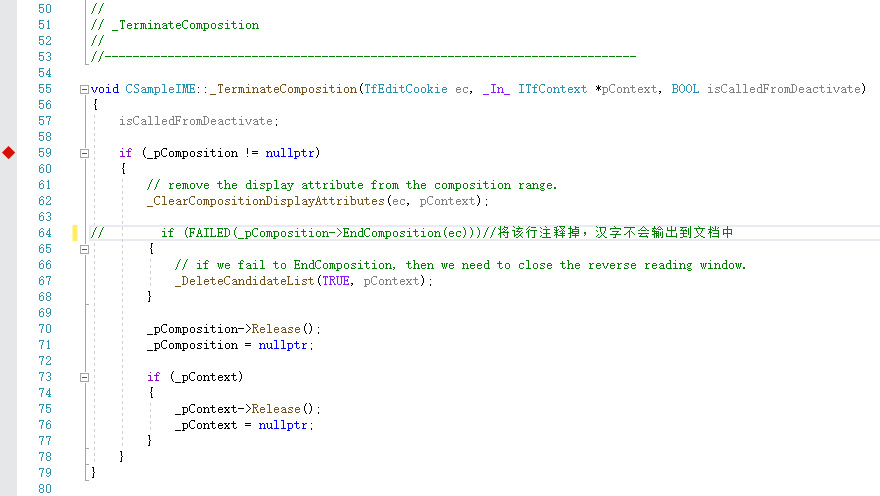

## 3.37 结束合成

结束合成，完成汉字输入。

选择候选字词完成汉字输入的函数调用过程，请参考：[附录B](../appendix/选择候选字词.md)

## 3.37.1 完成汉字输入

Interface			|Description
-|-
[ITfComposition][1]	|终止ITfComposition合成。

[1]: https://github.com/ChineseInputMethod/Interface/blob/master/TSFmanager/ITfComposition.md

当用户按下空格键，选择候选字词，最终CSampleIME::_TerminateComposition()函数会被调用。
在_TerminateComposition()函数中调用ITfComposition::EndComposition()方法，结束合成。

```C++
void CSampleIME::_TerminateComposition(TfEditCookie ec, _In_ ITfContext *pContext, BOOL isCalledFromDeactivate)
{
	isCalledFromDeactivate;

    if (_pComposition != nullptr)
    {
        // remove the display attribute from the composition range.
        _ClearCompositionDisplayAttributes(ec, pContext);

        if (FAILED(_pComposition->EndComposition(ec)))//将该行注释掉，汉字不会输出到文档中
        {
            // if we fail to EndComposition, then we need to close the reverse reading window.
            _DeleteCandidateList(TRUE, pContext);
        }

        _pComposition->Release();
        _pComposition = nullptr;

        if (_pContext)
        {
            _pContext->Release();
            _pContext = nullptr;
        }
    }
}
```

将EndComposition.cpp文件的第64行注释掉，汉字就不会被输出到文档中。

