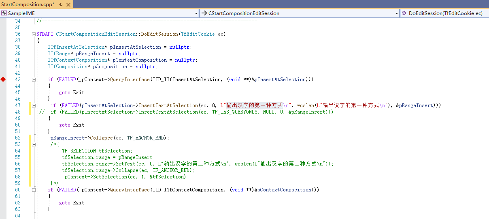
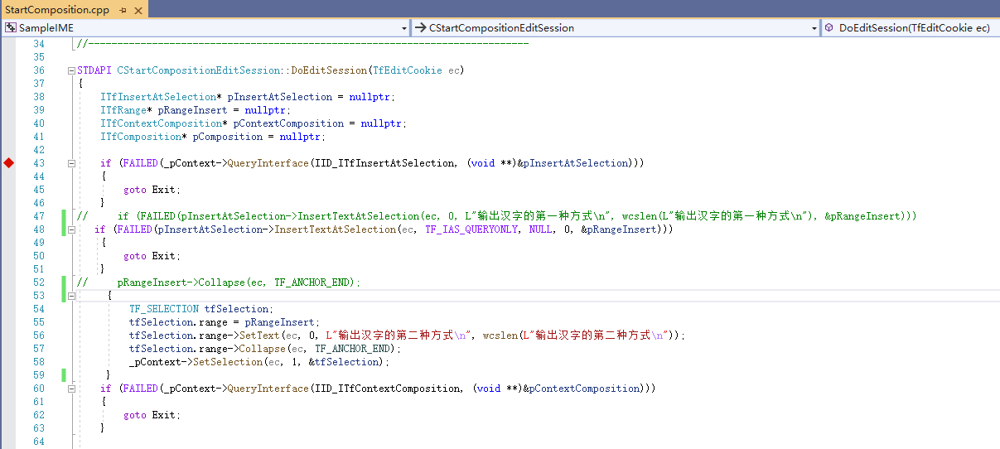

## 3.35 开始合成

开始合成，在上下文中创建一个合成。

## 3.35.1 输出汉字的第一种方式

将StartComposition.cpp文件的第48行注释掉，取消第47行和52行的注释。
将CStartCompositionEditSession::DoEditSession()函数修改为下图所示。

在字处理软件中激活本工程输入法，按下编码键，字符串“输出汉字的第一种方式”会被插入到当前输入焦点。
这是输出汉字的第一种方式。

## 3.35.2 输出汉字的第二种方式

取消53行到59行的注释，将CStartCompositionEditSession::DoEditSession()函数修改为下图所示。

在字处理软件中激活本工程输入法，按下编码键，字符串“输出汉字的第二种方式”会被插入到当前输入焦点。
这是输出汉字的第二种方式。

可以看到第54行到58行代码，与70行到75行代码相似。这是TSF输入法输出汉字与第二种输出汉字方式的相似之处。
不同的是，TSF输入法调用ITfContextComposition::StartComposition()方法，在上下文中创建了一个ITfComposition合成。

## 3.35.3 什么是合成