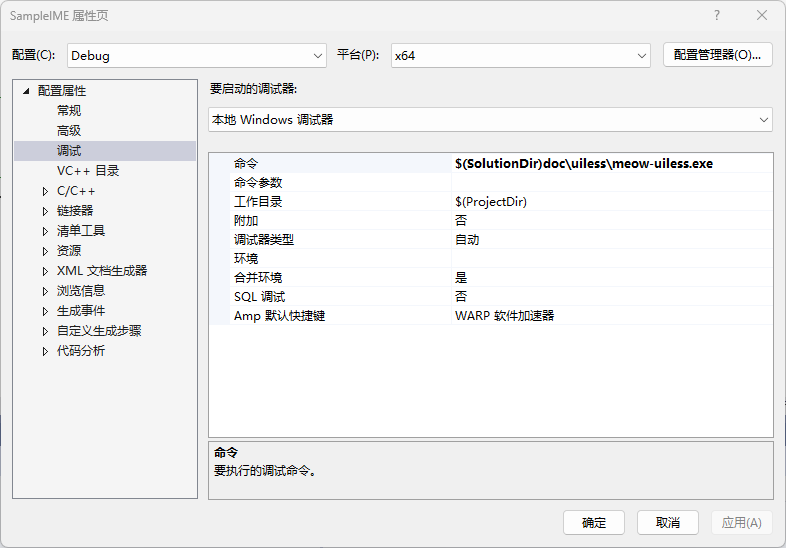

## 3.41 无界面模式

显示属性信息对象，为应用程序提供显示属性信息。

输入法需要实现ITfDisplayAttributeInfo接口，提供显示属性信息对象。

## 3.41.1 调试

该仓库下：https://github.com/yangyuan/meow

有个https://github.com/yangyuan/meow/tree/master/src/meow-uiless工程，可以用于调试输入法。

我在https://github.com/ChineseInputMethod/SampleIME/tree/master/doc/uiless目录下放置了一个编译好的该文件。

如图设置，即可调试无界面模式。

## 3.41.2 启动和按键处理

无界面模式的启动过程和按键处理函数调用，请参考：[附录C](启动过程.md)

启动过程和按键处理与普通模式几乎完全相同，唯一不同的地方是，在ITfTextInputProcessorEx::ActivateEx()方法中，dwFlags的状态值不同。

